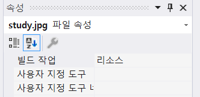

## System.IO.IOException

### Environment
- Language: C#
- IDE: Visual Studio

<br/>


### Problem
/images/user_icon.png에 user_icon.png 파일이 있음에도 해당 리소스를 찾을 수 없다는 예외 발생

```html
<Image
    Width="100" Height="100" 
    Source="/Resource/study.jpg"/>
```

```bash
System.IO.IOException
'/images/user_icon.png' 리소스가 없습니다.
```

<br/>


### Cause of Problem
새로운 이미지를 리소스 등록 후 재빌드하지 않아 미리보기 View에서는 나타나지만 실행 시, 보이지 않음

<br/>


### Solution

* 각 이미지 우 클릭 -> 속성 -> 빌드 작업: 없음 -> 리소스로 수정

<br/>


### 📚 참고 자료
[[WPF] Image가 나타나지 않을 때](https://gdpark.tistory.com/219)  
[[WPF] 이미지 등록과 이미지 나타내는 방법](https://clear-sky-sun.tistory.com/32)  
